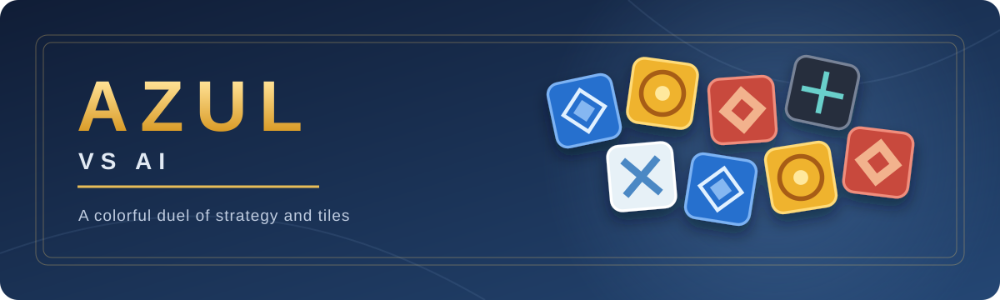

# 🟦 Azul vs AI



<p align="center">
  <strong>Build your wall. Outsmart the AI. Enjoy one more round.</strong><br />
  A two-player Azul game you can play right in your browser.
</p>

<p align="center">
  <a href="https://azul-ai-psi.vercel.app/"></a>
  
  
</p>

<p align="center">🟦 &nbsp; 🟨 &nbsp; 🟥 &nbsp; ⬛ &nbsp; ⬜</p>

## ✨ At a glance

| | |
| --- | --- |
| 🎯 **Pick your challenge** | Four AI levels: Easy, Normal, Hard, and Expert. Expert can think for up to about four seconds per move. |
| 🌐 **Play your way** | Switch between English and Japanese during a game. Your choice is remembered locally. |
| ↩️ **Try another move** | Undo back to your previous turn without losing the rest of the match. |
| 🎬 **Watch every move** | The AI's tiles glide from the factory to its board, and round scoring counts up line by line (+2, +3, −1…) like the physical game. Animations can be set to Normal, Fast, or Off. |
| 📈 **Review the game** | After the final score, see an evaluation graph of the whole match, replay it move by move, and compare each move with the AI's suggestion. Evaluations stay hidden while you play. |
| 🧠 **Stay in the flow** | The AI searches in a Web Worker, so the board stays responsive while it thinks. |

## 🎮 How to play

1. **Take tiles.** Click a color in one factory or in the center. You take every tile of that color from that source.
2. **Place them.** Click a highlighted pattern line or the floor. Tiles that do not fit go to the floor and may cost points.
3. **Build your wall.** Completed lines score at the end of each round. Finish a horizontal wall row to end the game, then collect row, column, and color bonuses.

Open **Rules** in the game for the full scoring details. The small number beside each score estimates what that player would gain at the end of the current round.

## 🚀 Run locally

```bash
npm ci
npm run dev
```

Visit <http://localhost:5173>. To create and preview the static production build:

```bash
npm run build
npm run preview
```

The output is written to `dist/` and can be hosted as a static site.

## 🧠 Inside the AI

Tile draws happen only when a new round begins, so a round is a perfect-information game once its factories are filled. The AI uses iterative-deepening alpha-beta search with principal variation search, a transposition table, and move ordering. Near the end of a round, it can search all the way to the last move.

At a search cutoff, it estimates the position from current points, partly filled lines, progress toward bonuses, nearby wall tiles, and the next first player. A short greedy playout finishes the round before evaluation. Completed games use the final score difference and outcome.

The evaluation weights were tuned through self-play. In the original tuning runs, the 300 ms/search version won **63% of 120 games** against an earlier version; at one second per move, it won **40/40** against the greedy AI, with an average score of **66–30**.

## 🧪 Test and tune

```bash
npm test
npm run selfplay -- --a search:200 --b greedy --games 20
npm run selfplay -- --a search:100:w.json --b search:100 --games 100
```

| Path | What it does |
| --- | --- |
| `src/engine/` | Game rules and scoring; state is stored in one `Int32Array`. |
| `src/ai/search.ts` | Alpha-beta search and the greedy opponent. |
| `src/ai/evaluate.ts` | Position evaluation and its weights. |
| `src/ai/worker.ts` | Background AI worker and difficulty settings. |
| `src/ui/` | Board rendering, animations, post-game review graph, interaction, and English/Japanese text. |
| `tests/` | Rules, AI, and browser UI tests. |
